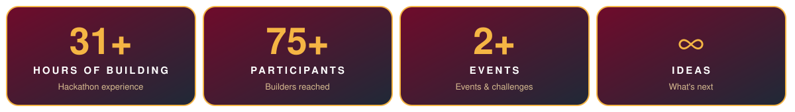
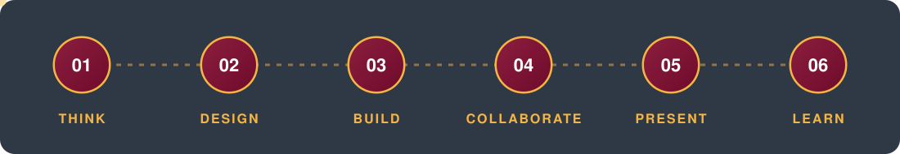
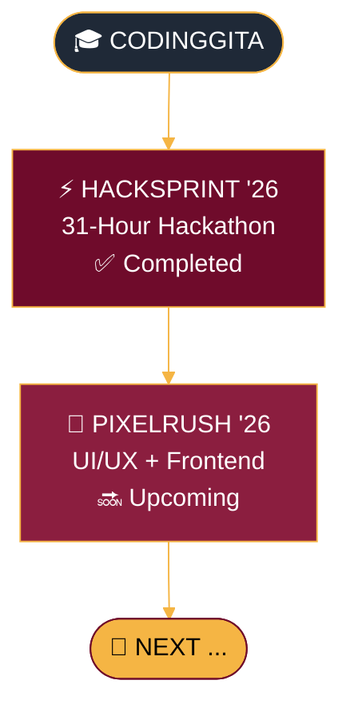
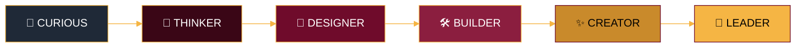
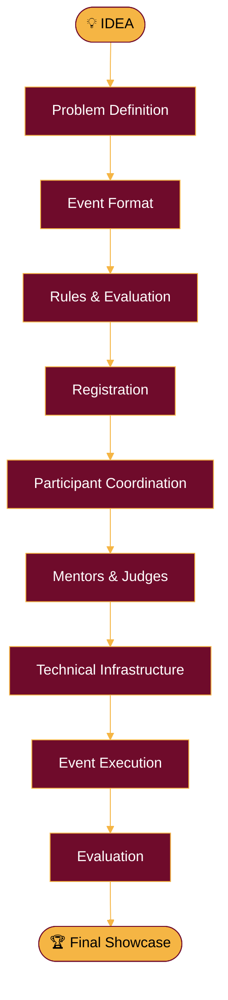
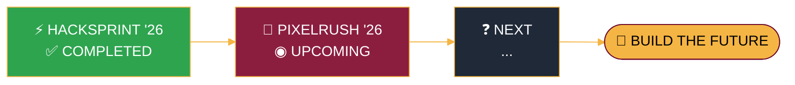

 

 

> ### **We don't just organize hackathons.**
> ### **We build the environment in which builders can thrive.**

**Quick Navigation**

[Who We Are](#01--who-we-are) • [At a Glance](#02--at-a-glance) • [What We Do](#03--what-we-do) • [Journey](#05--our-journey) • [HackSprint](#06--hacksprint-26) • [PixelRush](#07--pixelrush-26) • [Principles](#10--our-core-principles) • [Vision](#14--our-vision) • [Join](#18--join-the-journey)

# 01 — WHO WE ARE

The **CodingGita Hackathon Committee** is a student-driven organizing committee responsible for conceptualizing, planning, coordinating, and executing hackathons and technology-focused events at CodingGita.

From the first idea to the final presentation, we work across **planning, participant coordination, technical operations, mentor and judge coordination, evaluations, documentation, and event execution.**

Our purpose is simple:

| 🎯 | 💡 | 🛠️ |
|:---:|:---:|:---:|
| **Turn opportunities into experiences.** | **Turn ideas into products.** | **Turn participants into builders.** |

# 02 — AT A GLANCE

# 03 — WHAT WE DO

We operate across the **complete lifecycle** of technology events.

<table>
<tr>
<td width="50%" valign="top">

### 🎨 EVENT DESIGN
*We transform ideas into structured event experiences.*

- 🧩 Challenge design
- 📝 Problem statements
- 🗂️ Event formats
- 📜 Rules & guidelines
- 📊 Evaluation frameworks

</td>
<td width="50%" valign="top">

### ⚙️ EVENT OPERATIONS
*We make sure everything works when it matters.*

- 🧾 Registrations
- 👥 Team coordination
- 🖥️ Technical setup
- 🗓️ Scheduling
- 🚚 Event logistics

</td>
</tr>
<tr>
<td width="50%" valign="top">

### 🤝 COMMUNITY
*We bring builders, mentors, judges, and organizers together.*

- 🔥 Participant engagement
- 🧑‍🏫 Mentor coordination
- 💻 Developer communities
- 🌐 Collaboration
- 📣 Communication

</td>
<td width="50%" valign="top">

### 🏆 EVALUATION
*We create structured and meaningful evaluation experiences.*

- 🔍 Review rounds
- ⚖️ Judging criteria
- 💬 Feedback
- 🎤 Final presentations
- ✅ Project evaluation

</td>
</tr>
</table>

# 04 — OUR EVENT PHILOSOPHY

We believe the best technology events are not simply competitions.

> [!IMPORTANT]
> They are **learning environments disguised as challenges.**

Our events encourage participants to move through the complete product journey:

 

Because building something is one thing.

**Understanding how to build it is another.**

# 05 — OUR JOURNEY

What started with one hackathon is becoming a continuing journey of building better technical experiences for students.

# 06 — HACKSPRINT '26

**HackSprint '26** marked the beginning of our journey as an organizing committee.

A 31-hour hackathon that brought together **75+ aspiring builders** for an intensive experience of problem-solving, collaboration, development, debugging, and final pitching.

From registrations and technical coordination to mentoring, evaluations, and final presentations, the event was designed around one principle:

> [!TIP]
> **Learn by building.**

HackSprint '26 became the foundation for what we want the CodingGita Hackathon Committee to become — a platform for meaningful technical experiences.

<b>✨ What HackSprint represented</b>

 

| | |
|:---|:---|
| 🌍 Real-world problem solving | 🤝 Team collaboration |
| ⚡ Rapid development | 🔥 Learning under pressure |
| 🧑‍🏫 Mentorship | 🛠️ Technical execution |
| 🎤 Project presentation | |

# 07 — PIXELRUSH '26

> **Most hackathons ask: "Can you build it?"**
>
> **PixelRush asks: "Do you understand the problem first?"**

**PixelRush '26** is our upcoming UI/UX + Frontend hackathon built around a structured design-to-development journey.

Participants begin with **Figma**, move through a design review, unlock development, and finally present their working product.

### 🧭 The Challenge

### 🎯 The event focuses on

| 🧩 | 🧠 | 🎨 | 🔄 |
|:---:|:---:|:---:|:---:|
| **Problem understanding** | **UX thinking** | **Visual design** | **Design-to-code accuracy** |
| 💻 | ⚙️ | 🏅 | |
| **Frontend implementation** | **Functionality** | **Final product quality** | |

### 📦 The Final Product

**One challenge. One complete product journey.**

# 08 — WHAT MAKES OUR EVENTS DIFFERENT?

<table>
<tr>
<td align="center" width="25%" valign="top">

### 🌍 01
**REAL PROBLEMS**

We encourage participants to solve meaningful problems rather than build just for the sake of building.

</td>
<td align="center" width="25%" valign="top">

### 🪜 02
**STRUCTURED CHALLENGES**

Our events are designed with deliberate stages that test different skills.

</td>
<td align="center" width="25%" valign="top">

### 🔨 03
**BUILDING FIRST**

Participants learn through actual creation, iteration, failure, and execution.

</td>
<td align="center" width="25%" valign="top">

### 🧠 04
**BEYOND CODE**

We value problem-solving, design, communication, teamwork, and product thinking.

</td>
</tr>
</table>

# 09 — THE BUILDER'S JOURNEY

Every participant enters with an idea. We want them to leave with something more.

> A hackathon lasts hours. **The skills built during it last much longer.**

# 10 — OUR CORE PRINCIPLES

<table>
<tr>
<td width="50%" valign="top">

### 🎯 BUILD WITH PURPOSE
Technology is most powerful when it solves a real problem.

</td>
<td width="50%" valign="top">

### 🧪 LEARN BY DOING
The fastest way to understand something is often to build it.

</td>
</tr>
<tr>
<td width="50%" valign="top">

### 🤝 COLLABORATE OPENLY
Great products rarely come from one perspective.

</td>
<td width="50%" valign="top">

### 🎨 DESIGN BEFORE DEVELOPMENT
Understanding the user comes before writing the code.

</td>
</tr>
<tr>
<td width="50%" valign="top">

### 🔁 ITERATE WITHOUT FEAR
The first version doesn't need to be perfect.

</td>
<td width="50%" valign="top">

### ⚡ EXECUTE WITH DISCIPLINE
Ideas matter. **Execution makes them real.**

</td>
</tr>
</table>

# 11 — EVENT ARCHITECTURE

Behind every event is an entire system.

Our job is to make this entire journey feel **seamless** for the people actually building.

# 12 — BEYOND THE HACKATHON

A hackathon is only one format. The committee is working towards building a broader **ecosystem of student technology experiences.**

| | EXPERIENCE | PURPOSE |
|:---:|:---|:---|
| 🏁 | `Hackathons` | Build under real constraints |
| 🎨 | `UI/UX Challenges` | Think through design |
| 🧮 | `Technical Competitions` | Test technical depth |
| 💡 | `Innovation Challenges` | Explore new ideas |
| 📚 | `Workshops` | Learn new technologies |
| 🌐 | `Developer Events` | Connect and collaborate |
| 🎓 | `Student Initiatives` | Build community |
| 🖼️ | `Project Showcases` | Share what was built |

# 13 — WHAT'S NEXT?

### HackSprint '26 was the beginning.
### PixelRush '26 is the next chapter.
### The roadmap doesn't end there.

**More events. More builders. More ideas. More opportunities.**

# 14 — OUR VISION

> ## *"Create platforms where students don't just prepare for the future — they build it."*

We want to create an ecosystem where students can **experiment, collaborate, fail, iterate, present, and grow.**

Because sometimes the most important thing a student needs isn't another tutorial.

### **It's an opportunity to build.**

# 15 — POWERED BY CODINGGITA

The **CodingGita Hackathon Committee** operates within the CodingGita ecosystem with a focus on experiential learning and practical technology education.

| 🏛️ CodingGita | 💡 Students | 🎪 The Committee |
|:---:|:---:|:---:|
| provides the **platform** | bring the **ideas** | builds the **experience** |

 

**`LEARNING`** ➜ **`BUILDING`** ➜ **`EXPERIENCING`** ➜ **`GROWING`**

# 16 — THE ROAD AHEAD

We are just getting started.

# 17 — EXPLORE OUR WORK

As the committee grows, this organization will become a home for the projects, resources, systems, and experiences we build along the way.

### 🚧 Coming to this organization

| | CATEGORY | WHAT YOU'LL FIND |
|:---:|:---|:---|
| 📅 | `Event Resources` | Guidelines, schedules, and participant resources |
| 🧱 | `Starter Repositories` | Templates and starting points for builders |
| 📖 | `Documentation` | Event and technical documentation |
| 🧰 | `Tools` | Systems and utilities built for our events |
| 🚀 | `Projects` | Projects developed through our ecosystem |
| 🧪 | `Experiments` | New ideas and technical explorations |

# 18 — JOIN THE JOURNEY

Whether you're a:

there is always something worth building.

We're creating the platform. **You bring the curiosity.**

# 19 — OUR EVENTS

| EVENT | FOCUS | STATUS |
|:---:|:---:|:---:|
| ⚡ **HackSprint '26** | 31-Hour Hackathon | ✅ COMPLETED |
| 🎨 **PixelRush '26** | UI/UX + Frontend | 🔜 UPCOMING · 5–6 Oct 2026 |

# 20 — THE COMMITTEE

The CodingGita Hackathon Committee is built around students who believe that organizing a great technical experience requires more than running an event.

Every successful participant experience is backed by countless decisions and details happening behind the scenes. **That's the work we take responsibility for.**

# 21 — WHY WE BUILD

Technology is moving fast. The ability to learn, adapt, collaborate, and build matters more than ever.

We want students to experience that environment early.

Not someday. **Now.**

Every challenge we organize is an invitation to step forward, take an idea seriously, and see how far it can go.

# 22 — FINAL WORD

A hackathon may last a day.
A project may take a weekend.
An event may end when the final presentation is over.

But the skills, connections, confidence, and ideas created along the way can continue much further.

**That is what we want to build.**

`HACKSPRINT '26` &nbsp;•&nbsp; `PIXELRUSH '26` &nbsp;•&nbsp; `WHAT'S NEXT`

**Powered by CodingGita**

### `BUILD SOMETHING WORTH REMEMBERING.`

